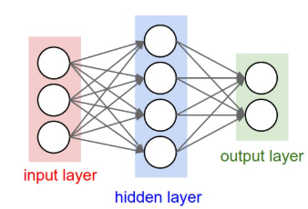

# 1. Word2Vec

## Key concepts

- **one-hot vectors**: regard words as discrete symbols

  - ```
    "cat" = [0,0,1,0,0,...]
    "dog" = [0,1,0,0,0,...]
    ```

  - vector dimension = number of words in vocabulary (very large)

  - Unable to express **similarity** for one-hot vectors (two vectors are **orthogonal**)

- **Distributional semantics**： A word's  meaning is given by the word that frequently appear close-by **(context)**

- **Word vectors**: also called word embeddings or word representations; they are a **distributed** representation

  - high-dimensional (usually 300 dimension)

- **Word2Vec**: is a framework for learning word vectors

- **Skip-grams(SG)**: Predict context words (position independent) given center word

- **Continuous Bag of Words(CBOW)**: Predict center word from context words

- **Singular Value Decomposition (SVD)**：SVD breaks a matrix into orthogonal directions ranked by how much information they carry.

  - $A=UΣV^⊤$


## Word2Vec Details

### Objective Function

- Use the similarity of the word vectors for **a center word c** and **context words o** to calculate the probability of  o given c (or vice versa)

- **Objective:**  Keep adjusting the word vectors to **maximize this probability**

  

- **Likelihood:**

$$
\text{Likelihood}=L(\theta)=\prod_{t=1}^T\prod_{-m\leq j\leq m}P\left(w_{t+j}\mid w_t;\theta\right)
$$

  - $\theta$ is **variables to be optimized**; actually is **all word vectors** here ($\theta\in R^{2dV}$).
  - m is the window size

- **Objective function $J(\theta)$**:

  - the **average negative log likelihood**
  - Maximizing predictive accuracy -> **Minimizing objective function** 

$$
J(\theta)=-\frac{1}{T}\log L(\theta)=-\frac{1}{T}\sum_{t=1}^T\sum_{-m\leq j\leq m}\log P(w_{t+j}|w_t;\theta)
$$

### Prediction Function

- mathematical expression **(use softmax function)**:

$$
P(o|c)=\frac{\exp(u_o^Tv_c)}{\sum_{w\in V}\exp(u_w^Tv_c)}
$$

  - $v_c$ is a center word; or input vector
  - $u_o$ is a context word; or output vector
  - **u and v are two different vectors; every word has two vectors in Word2Vec**;
    - After training, usually use $v_c$ as the word vectors; use the average of v and o is also OK
  - **V is the whole vocabulary, not only the words in the window**

### Optimization

- Use **gradient descent** to optimize the loss function $J(\theta)$

$$
\theta^{(t+1)}=\theta^{(t)}-\eta\nabla_\theta J(\theta)
$$

  - we want to **minimize the $J(\theta)$ here, so use minus**
  
- Simply put, make **the partial derivative** of the corresponding parameter **0**

- For center word vectors $v_c$

$$
\nabla_{v_c}J=u_o-\sum_{w\in V}P(w\mid c)u_w
$$

  - In practice, training uses the sum of the gradients over the context window

- For context word vectors $u_o$

$$
\nabla_{u_o}J=v_c(1-P(o\mid c))
$$

- For other word vectors $u_w$

$$
\nabla_{u_w}J=-P(w\mid c)v_c
$$


- **Stochastic gradient descent**:
  - Use SGD to reduce computation cost
  - During each training, **choose one or several samples (c,o)** to estimate the gradient, not all samples

### Negative Sampling

- Naive softmax has to go through the whole vocabulary. The computation is very expensive.

- **Negative sampling**: From multi-classification to **binary-classification**

  - Not asking:  "Of all the words, which is context?"
  - Instead: **"Given a pair (c, w), is it a real context pair, or random noise"**

- **Core formula**：

$$
J=-\log\sigma(u_o^\top v_c)-\sum_{i=1}^k\log\sigma(-u_{n_i}^\top v_c).
$$

  - $\sigma(x)=\frac{1}{1+e^{-x}}$, map the real value to 0~1
  - Positive sample： $u_o^\top v_c\gg0$
  - Negative sample:  $u_{n_i}^\top v_c\ll0$

- The negative samples are from noise distribution: $\mathrm{P}(w)=\mathrm{U}(w)^{3/4}/\mathrm{Z}$
  - **The power 3/4 makes less frequent words be sampled a bit more often**

## Co-occurrence matrix

### Co-occurrence vector

- Every word w corresponds to a V dimension vector (V is the size of vocabulary)：

$$
\mathbf{x}_w=\big((w,c_1),\;  (w,c_2),\;  \dots,\;  (w,c_{|V|})  \big)
$$

  - **#(w, c) is the number of times the word c appears in the context of w**

- Some problems:

  - curse of dimensionality
  - High frequency words dominate
  - co-occurrence matrix is **sparse**: information are stored in small number of dimensions

- **SVD:**

  - Running an SVD to reduce the dimensionality
  - Doesn't work well; **some frequent words has too much impact**

### GloVe

- **Core: The inner product of word vectors should be approximately equal to the logarithm of the number of co-occurrences of the word and context**

$$
w_i^⊤w_j≈logX_{ij}
$$

  - $X_{ij}$：the number of co-occurrences of the word i and context word j
  - $\mathbf{w}_i$：center word vector
  - $\tilde{\mathbf{w}}_j$：context word vector

- Loss Function:

$$
J=\sum_{i,j=1}^Vf\left(X_{ij}\right)\left(w_i^T\tilde{w}_j+b_i+\tilde{b}_j-\log X_{ij}\right)^2
$$

  - $b_i,b_j$: bias

  - \(f(x)\): **weight function**

$$
\boxed{f(x)= \begin{cases}\left(\frac{x}{x_{\max}}\right)^\alpha & x < x_{\max} \\    1 & \text{otherwise}    \end{cases}}
$$


  - large weight for small cooccurrence; small weight for large cooccurrence
  - Similar to 3/4 power in Negative Sampling

## Evaluation of word vectors

### Intrinsic Evaluation

- **Word Vector Analogies:** Evaluate the word vectors on intuitive semantic and syntactic analogy questions

  - 
$$
d=\arg\max_i\frac{\left(x_b-x_a+x_c\right)^Tx_i}{||x_b-x_a+x_c||}
$$


- Meaning similarity/correlation evaluation
- Fast to compute

### Extrinsic Evaluation

- evaluation on a real task

## Word sense ambiguity

- Different senses of a word reside in a linear superposition (**weighted sum**)
- $v_{pike} = \alpha_1v_{pike1}+\alpha_2v_{pike2}+\alpha_3v_{pike3}$

## Others

- **High-dimensional behavior:** word vectors are always represented in high-dimensional space. In high-dimensional space, **things can be very close to different things on different dimension**. For example, the word embeddings of "star" can be similar to astronomical words like "nebula". And **simultaneously**, it'll be close to words like "celebrity".


# 2. Neural Network

## Architecture of Neural Network

- Neuron Model:


- Basic Function:

$$
y=f(w^Tx+b)
$$

- **The role of activation function:**
  - Introduce non-linearities
  - neural networks can **approximate any complex function**

- Architecture of neural network：



## Backpropagation Algorithm

### Matrix calculus

- Basic principles: **Chain Rule** 

$$
\frac{\partial\mathcal{L}}{\partial w}=\frac{\partial\mathcal{L}}{\partial\hat{y}}\cdot\frac{\partial\hat{y}}{\partial z}\cdot\frac{\partial z}{\partial w}
$$

- **Hadamard product(⊙)**: element-wise multiplication of 2 vectors to give vector
-  Ignore specific mathematical derivation here (Great reference: [gradient-notes](./resources/gradient-notes.pdf))
- **shape convention**: A unified convention for the arrangement of dimensions of tensors
  - In actual code, usually use **row vector convention**:

- Input vector：
$$
x \in \mathbb{R}^{1 \times d}
$$

- Weight matrix：
$$
W \in \mathbb{R}^{d \times m}
$$

- Forward propagation：
$$
z = xW + b \quad (1 \times m)
$$

### Backpropagation

- **[downstream gradient] = [upstream gradient] x [local gradient]** (actually the chain rule)

$$
\frac{dy}{dx}=\frac{dy}{du}\cdot\frac{du}{dx}
$$

| math            | Backpropagation     |
| --------------- | ------------------- |
| $\frac{dy}{dx}$ | downstream gradient |
| $\frac{dy}{du}$ | upstream gradient   |
| $\frac{du}{dx}$ | local gradient      |

- if there are many upstream gradient, **sum them**:

  

- **Forward pass:** compute results of operations and save intermediate values
- **Backward pass:** apply chain rule to compute gradients

- **Checking**: use small h(≈ 1e-4)  to check

$$
f^{\prime}(x)\approx\frac{f(x+h)-f(x-h)}{2h}
$$

