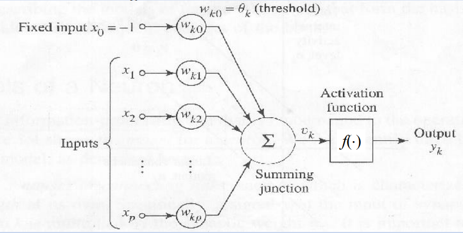

# 2. Neural Network

## Architecture of Neural Network

- Neuron Model:

  

- Basic Function:

$$
y=f(w^Tx+b)
$$

- **The role of activation function:**

  - Introduce non-linearities
  - neural networks can **approximate any complex function**

- Architecture of neural network：

  

## Backpropagation Algorithm

### Matrix calculus

- Basic principles: **Chain Rule** 

$$
\frac{\partial\mathcal{L}}{\partial w}=\frac{\partial\mathcal{L}}{\partial\hat{y}}\cdot\frac{\partial\hat{y}}{\partial z}\cdot\frac{\partial z}{\partial w}
$$

- **Hadamard product(⊙)**: element-wise multiplication of 2 vectors to give vector
- Ignore specific mathematical derivation here (Great reference: [gradient-notes](./resources/gradient-notes.pdf))
- **shape convention**: A unified convention for the arrangement of dimensions of tensors
  - In actual code, usually use **row vector convention**:

- Input vector：

$$
x \in \mathbb{R}^{1 \times d}
$$

- Weight matrix：

$$
W \in \mathbb{R}^{d \times m}
$$

- Forward propagation：

$$
z = xW + b \quad (1 \times m)
$$

### Backpropagation

- **[downstream gradient] = [upstream gradient] x [local gradient]** (actually the chain rule)

$$
\frac{dy}{dx}=\frac{dy}{du}\cdot\frac{du}{dx}
$$

| math            | Backpropagation     |
| --------------- | ------------------- |
| $\frac{dy}{dx}$ | downstream gradient |
| $\frac{dy}{du}$ | upstream gradient   |
| $\frac{du}{dx}$ | local gradient      |

- if there are many upstream gradient, **sum them**:

  

- **Forward pass:** compute results of operations and save intermediate values
- **Backward pass:** apply chain rule to compute gradients

- **Checking**: use small h(≈ 1e-4)  to check

$$
f^{\prime}(x)\approx\frac{f(x+h)-f(x-h)}{2h}
$$

## Others

### Regularization

- Suppression parameters are too large; avoid overfitting;
- if one parameter is too larger, the model will be very sensitive to the corresponding feature, which also means **the poor generalization**
- always use L2 regularzation

### dropout

- Randomly "turn off" some neurons during training, forcing the model to **not rely on certain specific neurons**, thereby improving generalization capabilities
