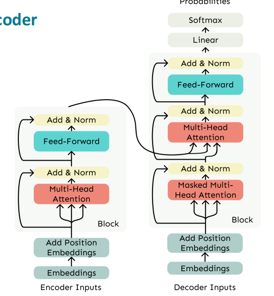

# Transformer

## Attention(attention-based seq2seq)

- Motivation：
  - **The fixed-length bottleneck**: the output of encoder (vector c) is fixed-size. if the input sequence is long, early information and details will be "crowded out"
  - **Long-distance dependencies are difficult to model**
- **Core Idea**: on each step of the decoder, **use direct connection to the encoder** to focus on a particular part of the source sequence.

**Operations**:

- Encoder no longer just outputs a vector; Instead, it outputs **a string of hidden states**

$$
(h_1, h_2, \dots, h_T)
$$

- at timestep t, take the current state $s_t$ as the **query**
- calculate the attention score with all hidden states $h_i$, and take softmax to get the **attention distribution $\alpha_i$**
- take a weighted sum, get the final **context vector**：

$$
c_t = \sum_i \alpha_{t,i} h_i
$$

- we **concatenate** the attention output $c_t$with the decoder hidden state $s_t$ and proceed as in the non-attention seq2seq model：

$$
\tilde{s}_t = \tanh(W_c [s_t ; c_t])
$$

- $s_t$: represent the grammatical structure to generate next
- $c_t$: Which part of the source sentence should I focus on now

- A nonlinear layer is equivalent to a **learned gate**: "How much encoder information should I use"

**Others:**

- In **attention-based seq2seq**, attention is only used in decoder stage (2014 Bahdanau)


## Self-attention

- Establish a direct connection between any two locations

- input sequence:

$$
X = (x_1, x_2, \dots, x_T)
$$

### Core of self-attention: Q,K,V

For each input vector $x_i$：
$$
\begin{aligned}
q_i &= W_Q x_i \\
k_i &= W_K x_i \\
v_i &= W_V x_i
\end{aligned}
$$

- Q：Query（what I am looking for）
- K：Key（what I can provide）
- V：Value（the actual content to be aggregated）

**Calculate the attention score**:

- attention of location i to location j：

$$
\text{score}_{ij} = \frac{q_i^\top k_j}{\sqrt{d_k}}
$$

- $\sqrt{d_k}$：Prevent excessive values

**Use Softmax gets weights**:
$$
\alpha_{ij} = \text{softmax}_j(\text{score}_{ij})
$$
**Weighted sum and get a new representation**
$$
z_i = \sum_{j=1}^{T} \alpha_{ij} v_j
$$

- $z_i$ ：**context-aware representation** of position i

### Position Embedding

- for  token $i$：

$$
\tilde{x}_i = x_i + p_i
$$

- $x_i$：token embedding
- $p_i$：position embedding

#### Position representation vectors

- **Sinusoidal Position Encoding**：

$$
\begin{aligned}
PE_{(pos, 2i)} &= \sin\left(\frac{pos}{10000^{2i/d}}\right) \\
PE_{(pos, 2i+1)} &= \cos\left(\frac{pos}{10000^{2i/d}}\right)
\end{aligned}
$$

- **Learnable Position Embedding**（Most systems use this）
  - Learned absolute position representations
  - Similar to vocabulary embedding

- **Relative Position Encoding **
  - influence attention score directly
  - $b_{i-j}$：Only related to relative distance

$$
q_i^\top k_j + b_{i-j}
$$

#### RoPE:

for position $p$,   **Q / K (not include V )**：
$$
\text{RoPE}(x, p) =
\begin{pmatrix}
x_0 \cos \theta_0 - x_1 \sin \theta_0 \\
x_0 \sin \theta_0 + x_1 \cos \theta_0 \\
x_2 \cos \theta_1 - x_3 \sin \theta_1 \\
x_2 \sin \theta_1 + x_3 \sin \theta_1 \\
\vdots
\end{pmatrix}
$$

$$
\theta_i = p / 10000^{2i/d}
$$

- **Attention score**：

$$
\langle \text{RoPE}(q_i, i), \text{RoPE}(k_j, j) \rangle
$$

- can be derived as:

$$
= \langle q_i, R_{j-i} k_j \rangle
$$

- only depends on **relative position $j - i$**


## FFN

- **Self-attention 负责“信息路由与混合”，FFN 负责“逐位置的非线性特征变换”**；没有 FFN，Transformer 基本退化为一个线性模型
- **Attention：跨位置（token-to-token)**
  - Attention 本质是“线性加权求和”; 
  - Attention 负责“从别的 token 拿信息”，但**不擅长“在一个 token 内做复杂变换”**
- **FFN：逐位置（channel-wise）**
  - 建模 **一个 token 内部的特征交互**

### 标准 FFN 形式

在每一层、对每一个位置 **独立地**：
$$
\text{FFN}(x) = W_2 \, \sigma(W_1 x + b_1) + b_2
$$

- $W_1: d \rightarrow d_{ff}$（升维）
- $\sigma$：ReLU / GELU（关键）
- $W_2: d_{ff} \rightarrow d$（降维）

**同一套参数**用于所有位置（position-wise）

### 为什么是“先 attention，再 FFN”？

顺序不是随意的:

1. **先聚合上下文信息**
2. **再在每个位置上做非线性处理**

## Masked attention

- In order to parallelize operations while **not looking at the future**
- By setting attention scores to $-\infty$:

$$
e_{ij}=\begin{cases}q_i^\top k_j,j\leq i\\-\infty,j>i&\end{cases}
$$

## Multi-head attention

- **core**: Multi-Head Attention 允许模型在多个不同子空间中并行地计算 attention，从不同“视角”建模序列关系

- 假设有 $h$ 个 head，每个 head 的维度是：

$$
d_k = d_v = \frac{d_{model}}{h}
$$

- 对第 $i$ 个 head：

$$
\begin{aligned}
Q_i &= X W_Q^{(i)} \\
K_i &= X W_K^{(i)} \\
V_i &= X W_V^{(i)}
\end{aligned}
$$

- 每个 head **有自己独立的线性投影参数**

- 每个 head 独立计算 attention

$$
\text{head}_i = \text{softmax}\left(\frac{Q_i K_i^\top}{\sqrt{d_k}}\right)V_i
$$

- 拼接 + 线性映射

$$
\text{MultiHead}(X)
=
\text{Concat}(\text{head}_1,\dots,\text{head}_h) W_O
$$

- 拼接后维度回到 $h \cdot d_v = d_{model}$
- 再映射到统一输出空间
- **方便 residual connection**

## Add & Norm

Formula：
$$
\text{Output} = \text{LayerNorm}(X + \text{Sublayer}(X))
$$
**Add（Residual / Skip Connection）**:

- Learning the increment instead of the full mapping

**Norm（Layer Normalization）**:

- 解决“不同 batch、不同 token 表示尺度不一致”问题

- 对**每个 token 的特征维度**做归一化：
  
$$
\text{LayerNorm}(x)
=
\gamma \frac{x - \mu}{\sigma} + \beta
$$
其中：

  - $\mu, \sigma$：在 **特征维度上** 计算
  - $\gamma, \beta$：可学习参数

### Pre-LN & Post-LN

**原始 Transformer（Post-LN）**

论文 *Attention Is All You Need* 使用的是：

```
X
 ↓
Sublayer(X)
 ↓
Add (X + Sublayer(X))
 ↓
LayerNorm
```

公式：
$$
\text{LN}(X + \text{Sublayer}(X))
$$
**现代 LLM 常用：Pre-LN**

```
X
 ↓
LayerNorm
 ↓
Sublayer
 ↓
Add
```

公式：
$$
X + \text{Sublayer}(\text{LN}(X))
$$

#### 为什么 Pre-LN 更好？

- 梯度更稳定
- 深层（几十、上百层）更容易训练
- 大模型（GPT、LLaMA）几乎全用 Pre-LN


## Transformer Encoder-Decoder

- 《Attention Is All You Need》
- NeurIPS 2017



- **早期注意力机制（2014）**：如 Bengio 等人提出的 RNN + attention 改善翻译模型（*Neural Machine Translation by Jointly Learning to Align and Translate*）
- **Transformer（2017）**：将 attention 提升为核心架构 → *Attention Is All You Need* [nrschlies.github.io](https://nrschlies.github.io/articles/Transformer.html?utm_source=chatgpt.com)
- **后续变种与预训练模型（2018 起）**：BERT（2018）、GPT-2/3/4、T5 等快速迭代